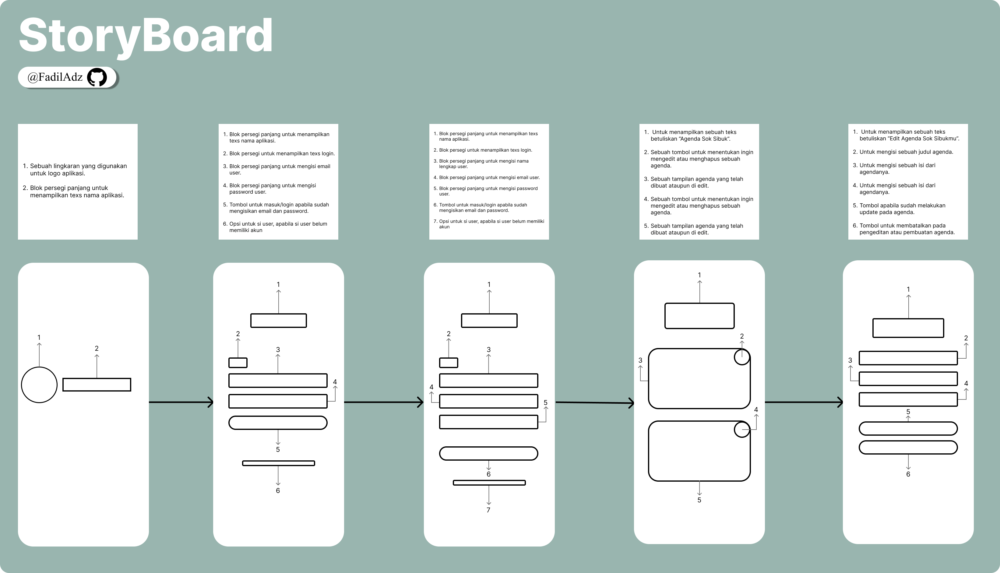
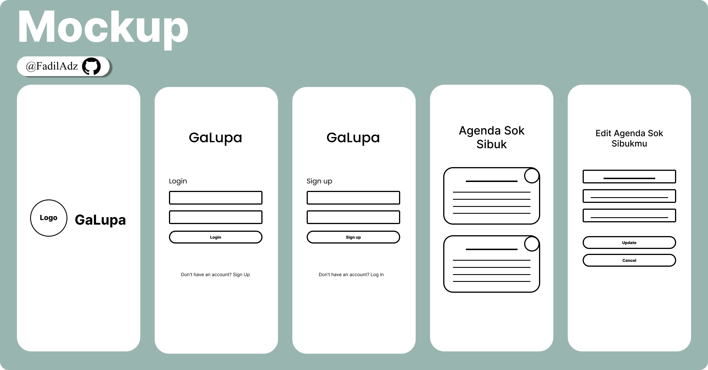
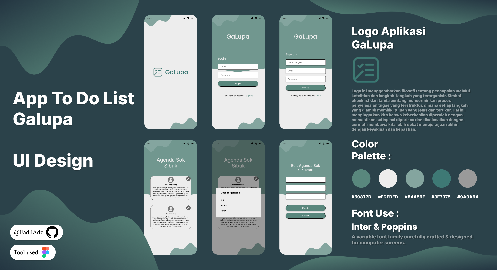
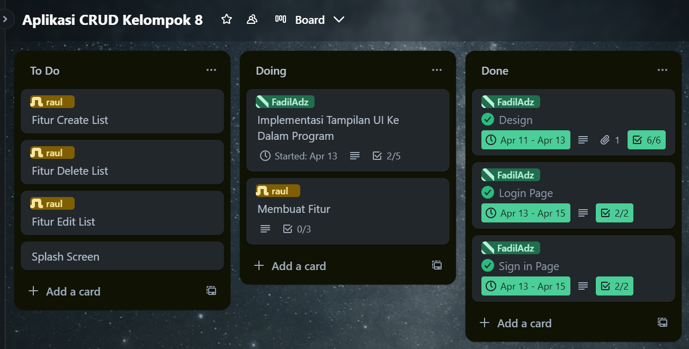

# 📱 AppGaLupa
AppGaLupa is an Android app designed to help users record and remember important activities, such as daily tasks, important notes, or things that are often forgotten. The app is built using Kotlin and follows modern Android development best practices.    

| Nama Anggota Kelompok | NIM |
|----|---|
|Fadil Aditya Adzima | 312310617|
|Raul Putra Widodo |312310610|
|Fahmi Arifin |312310662|

 

# $${\color{lightblue}StoryBoard}$$
 

    

This storyboard showcases the step-by-step user journey within an agenda management application, starting from the splash screen and login page, moving through the registration process, and continuing to the main features where users can view, create, edit, or delete agenda items.

   

# $${\color{lightblue}Mockup}$$
 

    

This mockup visualizes the user interface design of the GaLupa app, starting from the splash screen, followed by login and sign-up pages, and then leading to the main screen where users can view their agendas, as well as an edit screen for modifying existing agenda items.

   

# $${\color{lightblue}UI-Design}$$
 

    

The "Galupa" UI Design is a user interface concept for a To Do List application, created to help users stay organized and avoid forgetting their tasks. The design includes key screens such as the splash screen, login, sign-up, agenda list, and agenda editor, all arranged with a clean and intuitive layout. The logo reflects a philosophy of structure and precision in goal achievement, with a checklist symbol representing a systematic task completion process. The color scheme uses soft greens and neutral grays to create a calm yet professional look. Fonts used are Inter and Poppins, both chosen for their screen readability and modern appearance. This design was created using Figma and presented in a visual format ready for further development. 

   

# $${\color{lightblue}Dokumentasi-SCRUM}$$
 

    

This SCRUM board shows the progress of Kelompok 8's CRUD application project, with tasks divided into three columns: To Do (planned tasks), Doing (tasks currently in progress), and Done (completed tasks), allowing the team to collaborate and track work efficiently. [Klik Link Trello Disini!](https://trello.com/invite/b/67d910d93ab23cb51e7d57ab/ATTI8a0ab148ceeeedc3392544cb2da70b23A449A470/aplikasi-crud-kelompok-8)

